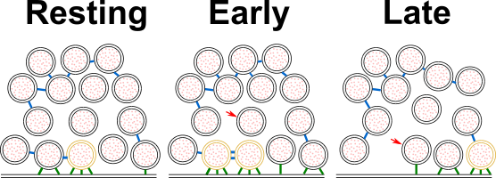

## Abstract {.page_break_before}
Synaptic vesicle (SV) fusion with the plasma membrane (PM) proceeds through intermediate steps that remain poorly resolved. 
The effect of persistent high or low exocytosis activity on intermediate steps remains unknown. 
Using spray-mixing plunge-freezing cryo-electron tomography we observe events following synaptic stimulation at nanometer resolution in near native samples. 
Our data suggest that during the stage that immediately follows stimulation, termed early fusion, PM and SV membrane curvature changes to establish a point contact. 
The next stage - late fusion - shows fusion pore opening and SV collapse. 
During early fusion, proximal tethered SVs form additional tethers with the PM and increase the inter-SV connector number. 
In the late fusion stage, PM-proximal SVs lose their interconnections, allowing them to move towards the PM. 
Two SNAP-25 mutations, one arresting and one disinhibiting spontaneous release, cause connector loss. 
The disinhibiting mutation causes loss of membrane proximal multiple-tethered SVs. 
Overall, tether formation and connector dissolution are triggered by stimulation and respond to spontaneous fusion rate manipulation. 
These morphological observations likely correspond to SV transition from one functional pool to another.

### Short summary
Upon exocytosis triggering, synaptic vesicles at the active zone gain transient tethers, possibly corresponding to super-priming. 
In a second phase, the number of inter-vesicular connections decreases, which may increase vesicle diffusion coefficient and accelerate readily-releasable pool replenishing.

###  Highlights
- We observed exocytosis events at various stages using cryo-electron tomography.
- Based on vesicle and plasma membrane morphology, the events were classified into early and late fusion.
- Tethers were formed during early fusion and lost during late fusion.
- SNAP-25 mutations affected tether formation and the level of inter-vesicular connections.

### Synopsis image
