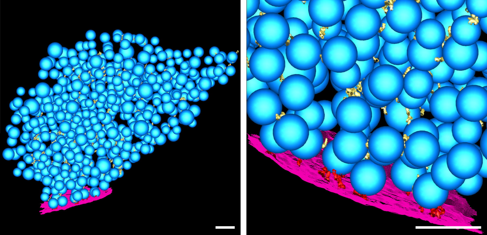
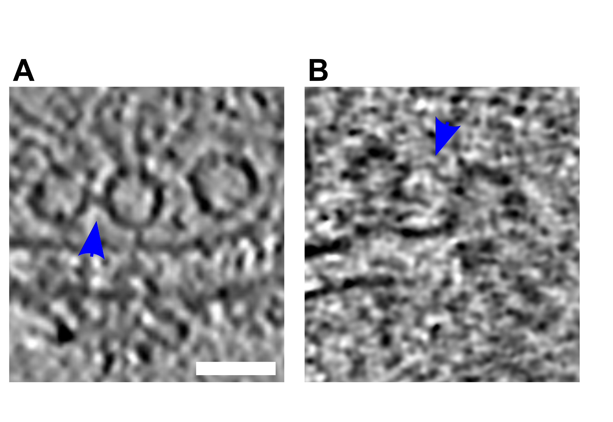

## Supplementary Material {.page_break_before}

### Supplementary Figures
![**Schematic representation of a spray-mixing plunge-freezing experiment. In a single experiment different synaptosomes get stimulated for between less than 1 ms and 7 ms.** An EM-grid is held by tweezers and is covered with synaptosomes in HBM-solution. A magnified view of a grid squares shows synaptosomes in blue and their synpatic state of three synapsomes is represented on the rightmost part of each panel. Panel (A) represents the situation right after blotting off solution excess. The grid is accelerated towards the spray and the cryogen. Panel (B) shows a snapshot of the experiment when the grid crosses the spray, 7 ms before the freezing. Some fluorescently dyed droplets containing HBM with 52 mM KCl land on the grid and are depicted in green. At this time point, a synaptosome located at the impact point of a droplet is activated and is depicted in dark blue. Panel (C) shows a snapshot 5 ms later, i.e. 2 ms before freezing. As KCl diffuses away from droplet impacts points, another synaptosomes gets activated because, locally KCl concentration has reached reached a concentration to depolarize enough the synaptosome so that voltage-gated calcium chanels open. Panel (D) shows a synaptosome at the time of impact with ethane. 0.1 ms before freezing a third synaptosome got exposed to a high enough concentration of KCl and got stimulated.](images/spray_freeze_workflow.png){#fig:suppl_spray_workflow width="15cm" tag="S1"}

{#fig:suppl_tomogram_slices width="15cm" tag="S2"}

{#fig:suppl_segmentation width="15cm" tag="S3"}

![(A, B) Histogram of the number of tethers per proximal SV. Statistical test: pairwise χ^2^-test between control and each experimental condition in the 0-tether group with Benjamini-Hochberg correction. \*: P<0.05. (C, D) Histogram of  the number of connectors per proximal non-RRP SV. (E, F) Histogram of the number of connectors per RRP SV. (G, H) Histogram of connected SV amongst tethered or non-tethered proximal SVs. (I, J) Histogram of connected SV amongst proximal non-RRP or RRP SVs. (A, C, E, G, I) Synapses in mouse cultured neurons. (B, D, F, H, J) Rat synaptosomes.](images/supplementary_connectors.png){#fig:suppl_histograms width="15cm" tag="S4"}

{#fig:suppl_connected_slices width="8cm" tag="S5"}

### Supplementary Movies

<video 
    controls
    width="100%" 
    alt="Tomogram with segmentation of synaptosome with late fusion events"
    poster="https://figshare.com/ndownloader/files/36069404/preview/36069404/img_preview.png"
>
  <source 
    src="https://figshare.com/ndownloader/files/36069404/preview/36069404/video_preview.mp4" 
    type="video/mp4"
  >
</video>
**Movie S1: Tomogram with segmentation of synaptosome with late fusion events.**
off-white = cell outline; pink = active zone; blue = synaptic vesicles; dark green = mitochondria; light green = large vesicles; yellow = connectors, red = tethers, scale bar 100nm

<video
  controls
  width="100%"
  alt="Tomogram with segmentation of WT SNAP-25 neurons"
  poster="https://figshare.com/ndownloader/files/36067523/preview/36067523/img_preview.png"
>
  <source
    src="https://figshare.com/ndownloader/files/36067523/preview/36067523/video_preview.mp4"
    type="video/mp4"
  >
</video>
**Movie S2: Tomogram with segmentation of WT SNAP-25 neurons.**
off-white= cell outline; pink = active zone; blue = synaptic vesicles; green = large vesicles; yellow = connectors, red = tethers, scale bar 100nm

### Supplementary Tables

|                    ID                    | Timepoint [ms] | Vesicles per Tomogram | Tethers per AZ | AZ surface area [µm²] | Connectors per synapse (0-250 nm) |
|:----------------------------------------:|:--------------:|:---------------------:|:--------------:|:---------------------:|:---------------------------------:|
|                 Control 1                |        0       |          220          |       15       |          0.11         |                331                |
|                 Control 2                |        0       |          104          |        8       |          0.04         |                264                |
|                 Control 3                |        0       |          127          |        4       |          0.05         |                230                |
|                 Control 4                |        0       |          143          |        3       |          0.03         |                482                |
|                 Control 5                |        0       |          213          |       12       |          0.11         |                361                |
|                 Control 6                |        0       |          104          |        7       |          0.06         |                199                |
|                 Control 7                |        0       |          184          |        9       |          0.03         |                360                |
|                 Control 8                |        0       |          132          |       19       |          0.09         |                226                |
|                 Control 9                |        0       |          134          |        6       |          0.08         |                326                |
|                                          |                |                       |                |                       |                                   |
|                  Spray 1                 |      late      |          697          |        5       |          0.03         |                272                |
|                  Spray 2                 |      late      |          115          |        3       |          0.08         |                 88                |
|                  Spray 3                 |      late      |          429          |       21       |          0.19         |                882                |
|                  Spray 5                 |      early     |          534          |       57       |          0.07         |                1412               |
| Spray 5_2  (second AZ, same synaptosome) |      early     |                       |       32       |          0.15         |                                   |
|                  Spray 6                 |      late      |          371          |        1       |          0.03         |                397                |
|                  Spray 7                 |      early     |          107          |        5       |          0.02         |                156                |
|                  Spray 8                 |      late      |           99          |        4       |          0.02         |                202                |
|                 Spray 10                 |      late      |           76          |        4       |          0.02         |                 96                |
Table: Summary of the synaptosome tomograms.
{#tbl:synaptosome-tomograms tag="S1"}

|  ID | Mutation | Vesicles per Tomogram | Tethers per AZ | AZ surface area [µm²] | Connectors per synapse (0-250 nm) |
|:---:|:--------:|:---------------------:|:--------------:|:---------------------:|:---------------------------------:|
|  73 |    4E    |          0-459          |       23       |          0.23         |                269                |
|  80 |    4E    |          105          |        6       |          0.21         |                 84                |
|  84 |    4E    |          109          |       10       |          0.12         |                107                |
|  88 |    4E    |          154          |       10       |          0.13         |                159                |
| 102 |    4E    |          103          |        0       |          0.29         |                 94                |
| 114 |    4K    |          123          |        2       |          0.09         |                 68                |
| 115 |    4K    |          137          |        1       |          0.26         |                 70                |
| 116 |    4K    |          278          |        1       |          0.13         |                154                |
| 123 |    4K    |           55          |        3       |          0.09         |                 52                |
| 128 |   WT-KO  |          243          |       12       |          0.18         |                683                |
| 132 |   WT-KO  |          126          |        2       |          0.24         |                110                |
| 133 |   WT-KO  |          505          |       27       |          0.17         |                229                |
| 134 |   WT-KO  |          600          |        7       |          0.34         |                144                |
Table: Summary of the neuron tomograms.
{#tbl:neuron-tomograms tag="S2"}

|             | mean number of connectors | number of vesicles |      std |      sem |   p-value 1 | p-value 2 | corrected p-value 1 | corrected p-value 2 |
|:------------|--------------------------:|-------------------:|---------:|---------:|------------:|-------------------:|--------------------:|--------------------:|
| (0-45, '4E')  |                   1.54902 |                 51 | 1.54031  | 0.215686 |           - |           0.333858 |                   - |            0.418108 |
| (0-45, '4K')  |                   1.82353 |                 17 | 2.210-459  | 0.537117 |           - |           0.851538 |                   - |            0.851538 |
| (0-45, 'WT')  |                   1.95122 |                 41 | 2.40781  | 0.376037 |           - |                  - |                   - |                   - |
| (45-75, '4E')  |                   1.11429 |                 35 | 1.20712  | 0.204041 |           - |           0.535421 |                   - |            0.568885 |
| (45-75, '4K')  |                  0.444444 |                 18 | 0.783823 | 0.184749 |           - |          0.0350148 |                   - |           0.0744065 |
| (45-75, 'WT')  |                       1.4 |                 10 | 1.50555  | 0.476095 |    0.494222 |                  - |            0.560118 |                   - |
| (75-150, '4E') |                   1.75776 |                161 | 1.9293   | 0.15205  |           - |          0.0195284 |                   - |           0.0474262 |
| (75-150, '4K') |                   1.62222 |                 90 | 1.73256  | 0.182627 |           - |          0.0164181 |                   - |           0.0474262 |
| (75-150, 'WT') |                     2.392 |                125 | 2.63627  | 0.235795 |    0.344324 |                  - |            0.418108 |                   - |
| (150-250, '4E') |                   1.53695 |                203 | 1.78341  | 0.125171 |           - |        1.66988e-10 |                   - |         9.46263e-10 |
| (150-250, '4K') |                       1.5 |                106 | 1.74711  | 0.169694 |           - |         5.9964e-07 |                   - |         2.54847e-06 |
| (150-250, 'WT') |                   3.23431 |                239 | 3.30957  | 0.214078 |   0.0182112 |                  - |           0.0474262 |                   - |
| (250-450, '4E') |                   1.270-451 |                255 | 1.67753  | 0.105051 |           - |        6.54299e-15 |                   - |         1.11231e-13 |
| (250-450, '4K') |                   2.57542 |                179 | 2.7598   | 0.206277 |           - |            0.32203 |                   - |            0.418108 |
| (250-450, 'WT') |                   2.81958 |                521 | 2.87196  | 0.125823 |   0.0600592 |                  - |            0.102101 |                   - |
| (450-900, '4E') |                   1.42081 |                221 | 1.79122  | 0.120491 |           - |        7.57199e-11 |                   - |         6.43619e-10 |
| (450-900, '4K') |                   2.35519 |                183 | 2.05409  | 0.151843 |           - |          0.0540546 |                   - |            0.102101 |
| (450-900, 'WT') |                   2.80112 |                538 | 2.88698  | 0.124467 | 0.066790-45 |                  - |            0.103228 |                   - |
Table: Statistical data related to Figure @{fig:connectors}A. p-value 1 and corrected p-value 1 refer to comparisons between wild-type subgroups and the 0-45 WT subgroup. p-value 2 and corrected p-value 2 refer to intra-distance group comparisons between each mutant and the wild-type. multiple all against reference pairwise ANOVA comparisons with Benjamini-Hochberg correction
{#tbl:statistics-connectors-a tag="S3"}

|                      |   mean number of connectors  | number of vesicles |     std |       sem |   p-value 1 |  p-value 2 |   corrected p-value 1 | corrected p-value 2  |
|:---------------------|---------------:|-------------------:|--------:|----------:|------------:|-----------:|-------------------------:|---------------------:|
| (0-45, 'non sprayed')   |       1.62222  |                 90 | 1.57635 | 0.166162  |           - |          - |             -            |                    - |
| (0-45, 'early fusion')  |       2.68889  |                 45 | 2.87483 | 0.428554  |           - | 0.00611329 |             -            |            0.0134492 |
| (0-45, 'late fusion')   |       0.947368 |                 38 | 1.08919 | 0.176691  |           - |  0.0176205 |             -            |            0.0276894 |
| (45-75, 'non sprayed')   |       1.47059  |                 68 | 1.56902 | 0.190271  |    0.549462 |          - |              0.755511    |                    - |
| (45-75, 'early fusion')  |       1.40909  |                 22 | 1.53248 | 0.326725  |           - |   0.872711 |             -            |             0.981532 |
| (45-75, 'late fusion')   |       1.45652  |                 46 | 1.48633 | 0.219147  |           - |   0.961833 |             -            |             0.981532 |
| (75-150, 'non sprayed')  |       2.38802  |                384 | 1.88936 | 0.0964159 | 0.000401512 |          - |              0.00220831  |                    - |
| (75-150, 'early fusion') |       2.98026  |                152 | 2.29156 | 0.18587   |           - | 0.00222876 |             -            |           0.00612908 |
| (75-150, 'late fusion')  |       2.82041  |                245 | 2.23065 | 0.142511  |           - | 0.00937208 |             -            |            0.0171822 |
| (150-250, 'non sprayed')  |       2.91697  |                554 | 2.2885  | 0.0972289 | 3.13053e-07 |          - |              3.44358e-06 |                    - |
| (150-250, 'early fusion') |       3.42705  |                281 | 2.19476 | 0.130929  |           - | 0.00210109 |             -            |           0.00612908 |
| (150-250, 'late fusion')  |       2.92051  |                390 | 2.35562 | 0.119281  |           - |   0.981532 |             -            |             0.981532 |
Table: Statistical data related to Figure @{fig:connectors}B. p-value 1 and corrected p-value 1 refer to comparisons between non sprayed subgroups and the 0-45 non sprayed subgroup. p-value 2 and corrected p-value 2 refer to intra-distance group comparisons between early fusion or late fusion and the non sprayed. Statistical test: multiple all against reference pairwise ANOVA comparisons with Benjamini-Hochberg correction
{#tbl:statistics-connectors-b tag="S4"}

|           | WT                        |                               |            |                     | 4E                        |                               |           |                     | 4K                        |                               |           |           |
|-----------|---------------------------|-------------------------------|------------|---------------------|---------------------------|-------------------------------|-----------|---------------------|---------------------------|-------------------------------|-----------|-----------|
|           | number of connected SVs   | number of non connected SVs   | p-value  1 | corrected p-value 1 | number of connected SVs   | number of non connected SVs   | p-value 2 | corrected p-value 2 | number of connected SVs   | number of non connected SVs   | p-value 2 | p-value 2 |
| 0-45      | 23                        | 18                            |            |                     | 28                        | 13                            | 0.36      | 0.6075              | 9                         | 8                             | 0.94      | 0.98      |
| 45-75     | 6                         | 4                             | 0.89       | 0.98                | 19                        | 13                            | 0.74      | 0.9039              | 6                         | 12                            | 0.33      | 0.594     |
| 75-150    | 87                        | 38                            | 0.16       | 0.3927              | 89                        | 38                            | 0.96      | 0.98                | 58                        | 32                            | 0.52      | 0.7155    |
| 150-250   | 184                       | 55                            | 0.008      | 0.0432              | 88                        | 49                            | 0.011     | 0.045               | 69                        | 37                            | 0.03      | 0.1013    |
| 250-450   | 399                       | 122                           | 0.0063     | 0.0045              | 126                       | 89                            | 0.0000015 | 0.0004              | 124                       | 55                            | 0.06      | 0.18      |
| 450-900   | 369                       | 169                           | 0.14       | 0.378               | 124                       | 96                            | 0.0018    | 0.0243              | 146                       | 37                            | 0.005     | 0.0425    |
Table: Statistical data related to Figure @{fig:connectors}C. p-value 1 and corrected p-value 1 refer to comparisons between wild-type subgroups and the 0-45 WT subgroup. p-value 2 and corrected p-value 2 refer to intra-distance group comparisons between each mutant and the wild-type. Statistical test: multiple all against reference pairwise χ^2^-test with Benjamini-Hochberg correction.
{#tbl:statistics-connectors-c tag="S5"}

|           | non sprayed             |                               |           |                     | early fusion            |                               |           |                     | late fusion             |                               |           |                     |
|-----------|-------------------------|-------------------------------|-----------|---------------------|-------------------------|-------------------------------|-----------|---------------------|-------------------------|-------------------------------|-----------|---------------------|
|           | number of connected SVs | number of non connected SVs   | p-value 1 | corrected p-value 1 | number of connected SVs | number of non connected SVs   | p-value 2 | corrected p-value 2 | number of connected SVs | number of non connected SVs   | p-value 2 | corrected p-value 2 |
| 0-45      | 63                      | 27                            |           |                     | 32                      | 13                            | 0.95      | 0.99                | 20                      | 18                            | 0.09      | 0.1913              |
| 45-75     | 46                      | 22                            | 0.89      | 0.99                | 16                      | 6                             | 0.86      | 0.99                | 32                      | 14                            | 0.99      | 0.99                |
| 75-150    | 323                     | 61                            | 0.0032    | 0.0109              | 129                     | 23                            | 0.93      | 0.99                | 213                     | 32                            | 0.39      | 0.663               |
| 150-250   | 483                     | 71                            | 0.00005   | 0.0003              | 258                     | 23                            | 0.06      | 0.1457              | 333                     | 57                            | 0.48      | 0.7418              |
Table: Statistical data related to Figure @{fig:connectors}D. p-value 1 and corrected p-value 1 refer to comparisons between non sprayed subgroups and the 0-45 non sprayed subgroup. p-value 2 and corrected p-value 2 refer to intra-distance group comparisons between early or late fusion and non sprayed samples. Statistical test: multiple all against reference pairwise χ^2^-test with Benjamini-Hochberg correction.
{#tbl:statistics-connectors-c tag="S6"}

|                            |  mean |  std  |  sem  | number of SVs | p-value | corrected p-value |
|----------------------------|-------|-------|-------|---------------|---------|-------------------|
| SVs with 0 to 2 tethers |
| WT | 2.029 | 2.588 | 0.444 | 34            | -       | -                 |
| 4E | 1.578 | 1.588 | 0.237 | 45            | 0.342   | 0.781             |
| 4K | 1.824 | 2.215 | 0.537 | 17            | 0.781   | 0.781             |
| SVs with 3 or more tethers |
| WT                         | 1.571 | 1.272 | 0.481 | 7             | -       | -                 |
| 4E                         | 1.333 | 1.211 | 0.494 | 6             | 0.738   | 0.781             |
| 4K                         |   0   |   0   |   0   | 0             | -       | -                 |
Table: Statistical data related to Figure @{fig:connectors}E. Statistical test: t-test.
{#tbl:statistics-connectors-d tag="S7"}

|                            |  mean |  std  |  sem  | number of SVs | p-value | corrected p-value | 
|----------------------------|-------|-------|-------|---------------|---------|-------------------|
| SVs with 0-2 tethers       |
| non sprayed                | 1.639 | 1.566 | 0.172 | 83            | -       | -                 |
| early fusion               | 2.688 | 3.053 |  0.54 | 32            | 0.017   | 0.034             |  
| late  fusion               | 0.909 | 1.071 | 0.186 | 33            | 0.016   | 0.034             |  
| SVs with 3 or more tethers |
| non sprayed                | 1.429 | 1.813 | 0.685 | 7             | 1            |                   |
| early fusion               | 2.692 | 2.496 | 0.692 | 13            | 0.25         | 0.33              |
| late fusion                | 1.200 | 1.304 | 0.583 | 5             | 0.81         | 0.81              |
Table: Statistical data related to Figure @{fig:connectors}F. Statistical test: multiple all against reference pairwise ANOVA comparisons with Benjamini-Hochberg correction
{#tbl:statistics-connectors-f tag="S8"}

|                  |  mean |  std  |  sem  | number of SVs | p-value | corrected p-value | 
|------------------|-------|-------|-------|---------------|---------|-------------------|
| non tethered SVs |
| WT               | 1.111 | 1.937 | 0.457 | 18 | -       | -                 | 
| 4E               |   1   |  1.18 | 0.241 | 24 | 0.82    |  0.93 |
| 4K               | 1.182 |  1.99 |  0.6  | 11 | 0.93    |  0.93 |
| tethered SVs     |
| WT | 2.609 | 2.572 | 0.536 | 23   | -       | - |
| 4E | 2.037 | 1.675 | 0.322 | 27   | 0.35    | 0.93 |
| 4K |   3   |  2.28 | 0.931 | 6    | 0.74    | 0.93 |
Table: Statistical data related to Figure @{fig:connectors}G. Statistical test: multiple all against reference pairwise ANOVA comparisons with Benjamini-Hochberg correction
{#tbl:statistics-connectors-g tag="S9"}

|                  |  mean |  std  |  sem  | number of SVs | p-value | corrected p-value | 
|------------------|-------|-------|-------|---------------|---------|-------------------|
| non tethered SVs |
|  ctrl            | 1.585 | 1.565 | 0.244 | 41 | -       | -                 | 
| early            | 3.111 | 3.689 |  1.23 |  9 | 0.052   | 0.0693            | 
| late             | 1.056 | 1.056 | 0.249 | 18 | 0.197   | 0.197             | 
| tethered SVs     |
| ctrl  | 1.653 | 1.601 | 0.229 | 49 | -       | -                 | 
| early | 2.583 | 2.687 | 0.448 | 36 | 0.05    | 0.0693            | 
| late  | 0.85  | 1.137 | 0.254 | 20 | 0.045   | 0.0693            | 
Table: Statistical data related to Figure @{fig:connectors}H. Statistical test: multiple all against reference pairwise ANOVA comparisons with Benjamini-Hochberg correction
{#tbl:statistics-connectors-h tag="S10"}